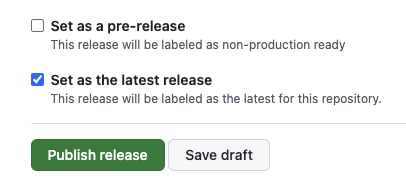
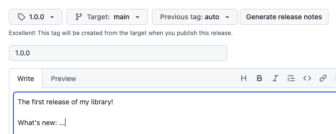
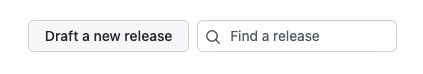
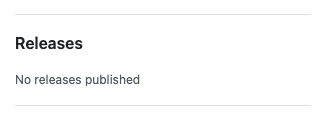
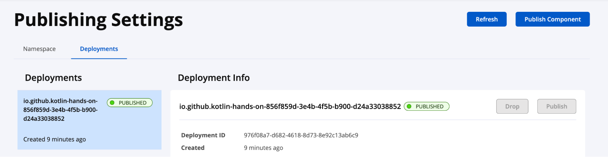
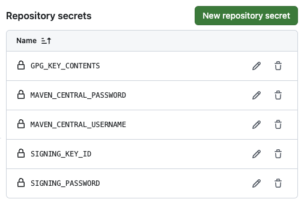

# Proceso de Release

Este documento describe el proceso para generar una nueva versión de la librería **json-to-compose** y publicarla en GitHub.

## Requisitos Previos

- Tener instalada la [GitHub CLI (gh)](https://cli.github.com/).
- Estar autenticado en GitHub (`gh auth status`).
- Haber actualizado el archivo `CHANGELOG.md` con los cambios de la nueva versión.
- Asegurarse de que la versión en `library/build.gradle.kts` coincida con la que se va a liberar.

## Pasos para el Release

### 1. Crear el Tag de Git

Primero, asegúrate de estar en la rama principal y tener todos los cambios confirmados. Luego, crea un tag local y súbelo al repositorio remoto.

```bash
# Crear el tag local
git tag 1.1.0

# Subir el tag a GitHub
git push origin 1.1.0
```

### 2. Crear el Release en GitHub

Una vez que el tag está en GitHub, puedes crear el release oficial. Es recomendable extraer las notas del release directamente del `CHANGELOG.md`.

#### Usando GitHub CLI (Recomendado)

Puedes usar el siguiente comando para crear el release adjuntando un archivo de notas:

```bash
# Crear un archivo temporal con las notas (ejemplo basado en el CHANGELOG)
cat <<EOF > release_notes.md
### Added
- Nueva funcionalidad X
- Soporte para Y

### Changed
- Refactorización de Z
EOF

# Crear el release en GitHub
gh release create 1.1.0 --title "v1.1.0" --notes-file release_notes.md

# Limpiar el archivo temporal
rm release_notes.md
```

#### Usando la Interfaz Web

Si prefieres hacerlo manualmente, sigue estas capturas de pantalla como guía:

1. **Configuración del Release:**
   

2. **Crear Tag y Release:**
   

3. **Borrador del Release:**
   

4. **Visualización en GitHub:**
   

### 3. Publicación en Maven Central

El proyecto está configurado para publicarse en Maven Central. Una vez que el release de GitHub está hecho, el proceso de publicación (si está automatizado por CI/CD) se activará o deberás ejecutar las tareas de Gradle correspondientes.



## Automatización con GitHub Actions

El repositorio cuenta con workflows en `.github/workflows/` que gestionan la publicación automática al detectar nuevos tags o releases. Asegúrate de que los secretos de GitHub estén configurados correctamente.


